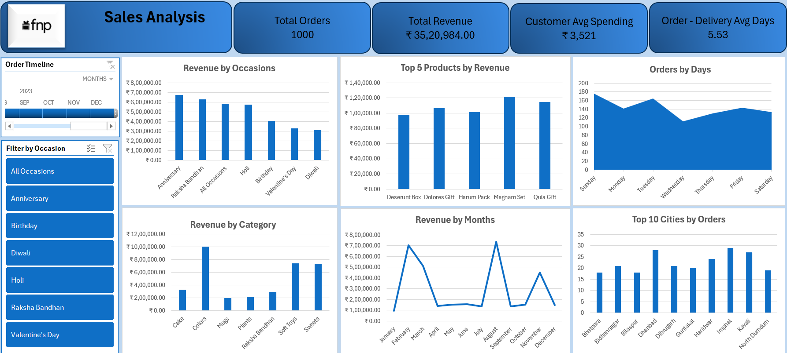

# FNP Sales Analysis

_Analyzing sales trends and customer behavior to support data-driven marketing and operational decisions using MS Excel._

---

## 📌 Table of Contents
- <a href="#overview">Overview</a>
- <a href="#business-problem">Business Problem</a>
- <a href="#dataset">Dataset</a>
- <a href="#tools--technologies">Tools & Technologies</a>
- <a href="#data-cleaning--preparation">Data Cleaning & Preparation</a>
- <a href="#questions--key-findings">Questions & Key Findings</a>
- <a href="#dashboard">Dashboard</a>
- <a href="#final-recommendations">Final Recommendations</a>
- <a href="#author--contact">Author & Contact</a>

---
<h2>Overview</h2>

This project focuses on analyzing the sales performance of Ferns N Petals (FNP) — a leading gifting and flower delivery brand in India. The analysis provides valuable insights into sales patterns, customer preferences, and regional performance, helping identify areas for growth and operational improvement.

---
<h2>Business Problem</h2>

In the competitive online gifting industry, effective sales planning and customer engagement are essential for sustained growth. Ferns N Petals (FNP) faces challenges such as uneven revenue distribution across cities, heavy reliance on festive seasons, and delayed deliveries affecting customer satisfaction.

This project aims to:
- Analyze sales performance across products, cities, and occasions.
- Identify top-performing categories and underperforming regions.
- Examine the impact of festive and weekday patterns on sales.
- Evaluate delivery efficiency and customer experience metrics.
- Provide data-driven recommendations for improving sales consistency, marketing strategy, and operational efficiency.

---
<h2>Dataset</h2>

The dataset contains detailed sales transactions from Ferns N Petals (FNP) for FY 2023–24.  
It includes information on orders, products, cities, occasions, and delivery performance.

Key attributes:
- **Order ID** – Unique transaction identifier  
- **Date** – Order and delivery dates  
- **City** – Customer location  
- **Product Category** – Type of item purchased (e.g., Flowers, Cakes, Gifts)  
- **Occasion** – Event for which the purchase was made  
- **Revenue** – Total sales amount per order  
- **Delivery Status** – On-time or delayed delivery  

---
<h2>Tools & Technologies</h2>

- Microsoft Excel (Pivot Tables, Pivot Charts, Formulas & Functions)
- Power Query (Data Cleaning & Transformation)
- GitHub

---
<h2>Data Cleaning & Preparation</h2>

- Removed unnecessary columns (e.g, Description)
- Created Revenue column using Quantity × Price column
- Converted data types and performed basic data modeling
- Prepared summary tables for products, categories, occasions, cities, and months for Pivot Tables & Pivot Charts

---
<h2>Questions & Key Findings</h2>

1. **Total Revenue**: Identify the overall revenue generated in 2023.
2. **Average Order & Delivery Time**: Evaluate how long it takes for orders to be delivered.
3. **Monthly Sales Performance**: Examine sales trends and fluctuations across each month of 2023.
4. **Top Products by Revenue**: Determine which products contribute the most to total revenue.
5. **Customer Spending Analysis**: Understand average spending per customer.
6. **Sales Performance of Top 5 Products**: Track performance and revenue of the top 5 products.
7. **Top 10 Cities by Orders**: Identify cities placing the highest number of orders.
8. **Order Quantity vs Delivery Time**: Analyze whether larger order quantities affect delivery speed.
9. **Revenue Comparison by Occasion**: Compare revenue generated during different occasions.
10. **Product Popularity by Occasion**: Identify which products are most popular for specific occasions.

---
<h2>Dashboard</h2>

- FNP Sales Analysis Dashboard (2023) shows:
  - Total Orders & Revenue: 1,000 orders generating ₹35,20,984 in revenue
  - Average Customer Spending: ₹3,521 per order
  - Order-Delivery Time: Average of 5.53 days
  - Revenue Trends: February and August show peak sales; March and November moderate increases
  - Occasion-Wise Insights: Anniversary and Raksha Bandhan drive the highest revenue; Holi and Birthday moderate; Valentine’s Day and Diwali lower
  - Category Performance: Colors, Soft Toys, and Sweets lead revenue; Cakes, Plants, and Mugs lag
  - Top 5 Products by Revenue: Magnam Set, Dolores Gift, Quia Gift, Harum Pack, Deserunt Box
  - Customer Behavior: Highest orders on Sundays; midweek dips, especially Wednesday
  - Regional Insights: Imphal, Kavali, Dhanbad top performers; Smaller cities like Bhatpara, Bilaspur and North Dumdum showed lower order volumes

---
<h2>Recommendations</h2>

-	Boost marketing for mid-tier occasions (Holi, Valentine’s Day).
-	Launch mid-week offers to smooth weekday sales.
-	Run targeted campaigns in underperforming regions and cities.
-	Promote Anniversary & Raksha Bandhan collections early.
- Optimize delivery operations to reduce average delivery time.

---
<h2>Author & Contact</h2>

**Mohd Ziyan**  
Data Analyst  
📧 Email: mziyan.379@gmail.com  
🔗 [LinkedIn](https://www.linkedin.com/in/mohd-ziyan-686b93312/)  
🔗 [Twitter](https://x.com/mohdziyan045)
